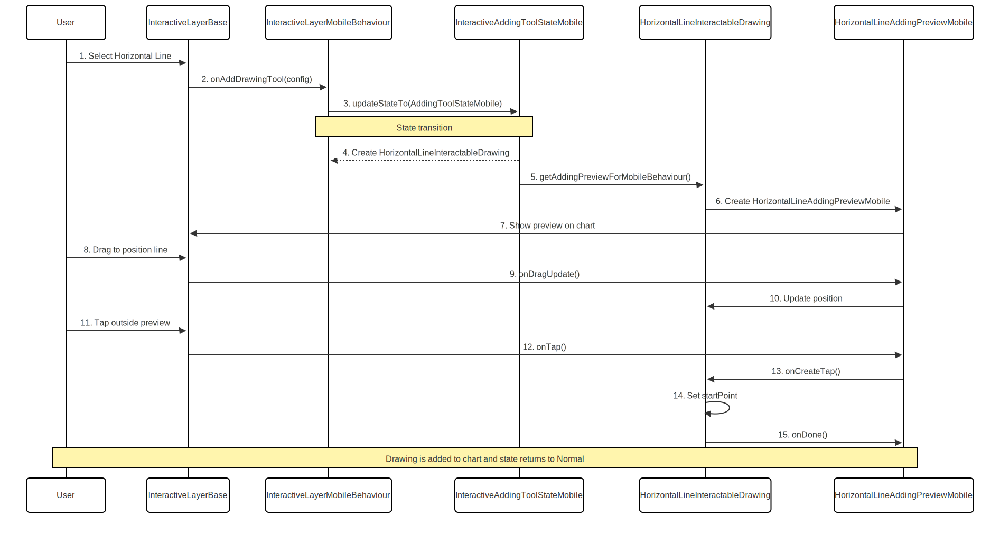

# Interactive Layer

The Interactive Layer is a crucial component of the Deriv Chart that handles user interactions with drawing tools. It manages the lifecycle of drawing tools, from creation to manipulation, and provides a state-based architecture to handle different interaction modes.

## Overview

The Interactive Layer sits on top of the chart canvas and captures user gestures such as taps, drags, and hovers. It then interprets these gestures based on the current state and translates them into actions on drawing tools.

The layer works with two key concepts:
1. **InteractiveState**: Defines the current mode of interaction with the chart
2. **DrawingToolState**: Represents the state of individual drawing tools

## Interactive States

The Interactive Layer implements a state pattern to manage different interaction modes. Each state handles user interactions differently:

### InteractiveNormalState

This is the default state when no drawing tools are selected or being added. In this state:
- The user can tap on existing drawing tools to select them
- The user can initiate adding a new drawing tool
- All drawing tools are in the `DrawingToolState.idle` state
- Includes hover functionality through the `InteractiveHoverState` mixin

### InteractiveSelectedToolState

This state is active when a drawing tool is selected. In this state:
- The selected tool is in the `DrawingToolState.selected` state
- The user can drag the selected tool to move it
- The user can modify specific points of the selected tool
- Tapping outside the selected tool returns to the `InteractiveNormalState`
- Includes hover functionality through the `InteractiveHoverState` mixin

### InteractiveAddingToolState

This state is active when a new drawing tool is being added to the chart. In this state:
- The new tool is in the `DrawingToolState.adding` state
- The user can tap on the chart to define points for the new tool (e.g., start and end points for a line)
- Once the tool creation is complete, the state transitions back to `InteractiveNormalState`

### InteractiveHoverState

This is implemented as a mixin rather than a standalone state, allowing it to be combined with other states:
- Provides hover detection functionality to any state that includes it
- Changes a drawing tool's state to `DrawingToolState.hovered` when the pointer hovers over it
- Reverts the tool's state when the pointer moves away
- Currently used by both `InteractiveNormalState` and `InteractiveSelectedToolState`

This mixin-based approach allows hover functionality to be reused across different states without code duplication, following the composition over inheritance principle.

## State Transitions

The Interactive Layer manages transitions between states based on user interactions:

1. **NormalState → SelectedToolState**: Occurs when the user taps on or starts dragging an existing drawing tool
2. **SelectedToolState → NormalState**: Occurs when the user taps outside the selected tool
3. **NormalState → AddingToolState**: Occurs when the user initiates adding a new drawing tool
4. **AddingToolState → NormalState**: Occurs when the new tool creation is complete

Note that both NormalState and SelectedToolState include the HoverState functionality through the mixin pattern.

For a comprehensive visual representation of the architecture and state transitions, see the Interactive Layer Architecture Diagram section below.

## DrawingToolState

Each drawing tool on the chart has its own state, represented by the `DrawingToolState` enum:

```dart
enum DrawingToolState {
  /// Default state when the drawing tool is displayed on the chart
  /// but not being interacted with.
  idle,

  /// The drawing tool is currently selected by the user. Selected tools
  /// typically show additional visual cues like handles or a glowy effect
  /// to indicate they can be manipulated.
  selected,

  /// The user's pointer is hovering over the drawing tool but hasn't
  /// selected it yet. This state can be used to provide visual feedback
  /// before selection.
  hovered,

  /// The drawing tool is in the process of being created/added to the chart.
  /// In this state, the tool captures user inputs (like taps) to define
  /// its shape and position.
  adding,

  /// The drawing tool is being actively moved or resized by the user.
  /// This state is active during drag operations when the user is
  /// modifying the tool's position.
  dragging,
  
  /// The drawing tool is being animated.
  /// This state can be active, for example, when we're in the animation effect
  /// of selecting or deselecting the drawing tool and the selection animation
  /// is playing.
  animating,
}
```

The state of a drawing tool affects how it's rendered on the chart and how it responds to user interactions.

## InteractableDrawing

The `InteractableDrawing` class is the base class for all drawing tools that can be interacted with on the chart. It:

1. Maintains the current state of the drawing tool
2. Provides methods for hit testing (determining if a user tap/drag intersects with the tool)
3. Handles drag operations to move or modify the tool
4. Defines how the tool is painted on the canvas based on its current state

Each specific drawing tool (like `LineInteractableDrawing`) extends this class to implement its own behavior for:
- Hit testing specific to its shape
- Handling drag operations in a way that makes sense for its geometry
- Painting itself with appropriate visual styles based on its state

## DrawingAddingPreview

The `DrawingAddingPreview` class is a specialized component that handles the preview and creation process of drawing tools. It serves as a temporary visual representation during the drawing tool creation process and is responsible for:

1. Displaying a preview of the drawing being created
2. Showing alignment guides, hints, or other visual aids
3. Handling user interactions during the drawing creation process
4. Coordinating with the `InteractiveLayerBehaviour` to manage platform-specific interactions

The preview exists only during the drawing addition lifecycle and is removed once the drawing is fully created and added to the chart. Different drawing tools implement their own specific preview behaviors by extending this class.

Key characteristics of `DrawingAddingPreview`:

- It implements the `DrawingV2` interface, just like `InteractableDrawing`
- It holds a reference to the actual `InteractableDrawing` instance being created
- It works with `InteractiveLayerBehaviour` to handle platform-specific interactions
- It provides the `onCreateTap` method that captures user taps to define the drawing's shape
- Different drawing tools require different numbers of taps to complete (e.g., a horizontal line may require just one tap, while a trend line requires two taps)

### Platform-Specific Behaviors

The Interactive Layer supports different behaviors based on the platform (desktop or mobile) through the `InteractiveLayerBehaviour` abstract class:

- **Desktop Behavior**: Optimized for mouse interactions, including hover events and precise clicking
- **Mobile Behavior**: Optimized for touch interactions, with appropriate touch targets and gestures

Each drawing tool can provide different preview implementations for desktop and mobile through the `getAddingPreviewForDesktopBehaviour` and `getAddingPreviewForMobileBehaviour` methods in `InteractableDrawing`.

## Implementation Details

The Interactive Layer uses a combination of gesture detectors and custom painters to:

1. Capture user interactions (taps, drags, hovers)
2. Determine which drawing tools are affected by these interactions
3. Update the state of the Interactive Layer and individual drawing tools
4. Render the drawing tools with appropriate visual styles

When a user interacts with the chart, the Interactive Layer:
1. Determines the current state
2. Delegates the handling of the interaction to the current state object
3. The state object updates the affected drawing tools
4. The drawing tools are repainted with their new states and positions

This architecture provides a clean separation of concerns and makes it easy to add new interaction modes or drawing tool types.

## Interactive Layer Architecture Diagram

The following diagram illustrates the architecture and flow of the Interactive Layer, including the relationships between InteractiveStates, InteractiveLayerBehaviour, and DrawingAddingPreview:



### Flow Explanation:

1. **User Interaction**:
   - User interactions (taps, drags, hovers) are captured by the `InteractiveLayerBase`
   - These events are passed to the appropriate `InteractiveLayerBehaviour` implementation

2. **Platform-Specific Handling**:
   - The `InteractiveLayerBehaviour` determines how interactions should be handled based on the platform:
     - **Desktop Behaviour**: Optimized for mouse interactions, hover events, and precise positioning
     - **Mobile Behaviour**: Optimized for touch interactions, gestures, and larger touch targets

3. **State Management**:
   - The current `InteractiveState` processes the interaction based on the current mode:
     - **NormalState**: Default state for selecting existing tools or initiating new tool creation
     - **SelectedState**: When a tool is selected, showing control points for manipulation
     - **AddingState**: When a new tool is being created, capturing coordinates and showing preview

4. **Drawing Creation Process**:
   - When adding a new drawing:
     - The appropriate `DrawingAddingPreview` is created based on the platform
     - Desktop Preview: Handles mouse-based creation with hover feedback
     - Mobile Preview: Handles touch-based creation with appropriate gesture recognition
     - The preview handles user interactions to define the drawing's shape
     - Once complete, the final `InteractableDrawing` is added to the chart
     - The state transitions back to `NormalState`

5. **Drawing Tool States**:
   - Each drawing tool can be in one of several states as defined by the `DrawingToolState` enum
   - These states determine how the drawing is rendered and how it responds to user interactions
   - See the DrawingToolState section for details on each state

This architecture provides a flexible framework that:
- Separates platform-specific behavior from core functionality
- Manages state transitions cleanly
- Supports different drawing tools with minimal code duplication
- Provides appropriate previews during the drawing creation process
- Adapts to different input methods across platforms

## Example: Adding a Horizontal Line on Mobile

To illustrate how the Interactive Layer components work together in practice, let's walk through the process of adding a horizontal line drawing tool on a mobile device:

### Sequence Diagram



### Flow Explanation

1. **User Initiates Drawing**: The user selects the horizontal line drawing tool from the UI.

2. **Configuration Creation**: The system creates a `HorizontalDrawingToolConfig` object with the default settings for a horizontal line.

3. **State Transition**: The `InteractiveLayerBase` calls `onAddDrawingTool(config)` on the `InteractiveLayerMobileBehaviour`, which transitions to the `InteractiveAddingToolStateMobile`.

4. **Drawing Creation**: The `InteractiveAddingToolStateMobile` creates a new `HorizontalLineInteractableDrawing` instance with the provided configuration.

5. **Preview Creation**:
   - The `InteractiveAddingToolStateMobile` calls `getAddingPreviewForMobileBehaviour()` on the drawing to get the appropriate preview for mobile
   - This returns a new `HorizontalLineAddingPreviewMobile` instance
   - The preview is initialized with a reference to the `HorizontalLineInteractableDrawing` and the `InteractiveLayerMobileBehaviour`

6. **Preview Display**: The preview is shown on the chart with an initial position, displaying a dashed horizontal line that follows the user's finger as they move it across the screen.

7. **Positioning the Line**: After the preview is shown:
   - The user can drag to position the horizontal line at the desired height
   - Drag events are captured by the `InteractiveLayerBase`
   - These events are passed to the `HorizontalLineAddingPreviewMobile.onDragUpdate()` method
   - The preview updates the position of the line in real-time as the user drags

8. **Confirming the Drawing**: When the user is satisfied with the position:
   - The user taps outside the preview (not on the tool itself)
   - The tap event is captured by the `InteractiveLayerBase`
   - It's passed to the current state (`InteractiveAddingToolStateMobile`)
   - The state forwards it to the `HorizontalLineAddingPreviewMobile.onCreateTap()` method
   - The `onCreateTap()` method sets the `startPoint` of the `HorizontalLineInteractableDrawing`
   - It then calls the `onDone()` callback to signal that the drawing is complete
   - The `InteractiveAddingToolStateMobile` transitions back to `InteractiveNormalState`
   - The horizontal line is added to the chart as a permanent drawing

9. **Result**: A horizontal line is now displayed on the chart at the position where the user tapped, and the system returns to the normal state where the user can select or add other drawings.

This example demonstrates how the various components of the Interactive Layer work together to provide a smooth and intuitive drawing experience, with platform-specific behavior handled through the appropriate preview classes.